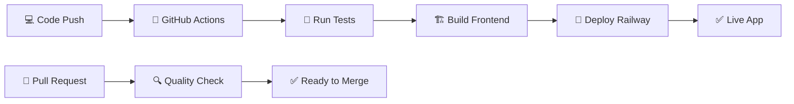

# 🤖 CI/CD Pipeline - Resumo Executivo

## ✅ O que foi configurado

Criei um **pipeline completo de CI/CD** que automatiza todo o processo de deploy do seu Sistema de Funcionários no Railway.

## 🎯 Benefícios Imediatos

- ✅ **Deploy automático** a cada push para main
- ✅ **Testes automáticos** antes do deploy
- ✅ **Build otimizado** para produção
- ✅ **Notificações** de status em tempo real
- ✅ **Rollback fácil** se algo der errado

## 📁 Arquivos Criados

```
📦 CI/CD Configuration
├── .github/workflows/
│   ├── 🚂 railway-deploy.yml      # Pipeline principal
│   ├── 🔍 pr-check.yml           # Verificação de PRs
│   └── 🚀 deploy.yml             # Pipeline avançado
├── 📋 GITHUB-ACTIONS-SETUP.md    # Guia completo
├── 🔐 setup-github-secrets.md    # Configuração de secrets
├── 🧪 test-pipeline.sh           # Teste local
├── ⚙️ railway.toml               # Configuração Railway
└── 📊 CI-CD-SUMMARY.md           # Este arquivo
```

## 🚀 Como Ativar (5 minutos)

### 1. Configurar Railway Token
```bash
# 1. Acesse: https://railway.app/account/tokens
# 2. Crie token: "github-actions"
# 3. Copie o token
```

### 2. Configurar GitHub Secret
```bash
# 1. GitHub > Settings > Secrets and variables > Actions
# 2. New repository secret
# 3. Name: RAILWAY_TOKEN
# 4. Value: [seu token]
```

### 3. Ativar Pipeline
```bash
git add .
git commit -m "feat: configurar CI/CD"
git push origin main
```

## 🔄 Fluxo Automático



## 📊 Workflows Disponíveis

| Workflow | Trigger | Ação | Tempo |
|----------|---------|------|-------|
| **railway-deploy.yml** | Push to main | Deploy completo | ~3-5 min |
| **pr-check.yml** | Pull Request | Testes apenas | ~2-3 min |
| **deploy.yml** | Push to main | Deploy avançado | ~4-6 min |

## 🎛️ Recursos Incluídos

### Testes Automáticos
- ✅ Backend tests (se existirem)
- ✅ Frontend tests com coverage
- ✅ Build verification
- ✅ Dependency check

### Deploy Inteligente
- ✅ Build otimizado para produção
- ✅ Variáveis de ambiente automáticas
- ✅ Health check pós-deploy
- ✅ Rollback em caso de falha

### Monitoramento
- ✅ Logs detalhados em tempo real
- ✅ Notificações de status
- ✅ Métricas de build
- ✅ Histórico completo

## 🔧 Configurações Avançadas

### Variáveis de Ambiente (Railway)
```env
JWT_SECRET=sua_chave_super_secreta
NODE_ENV=production
PORT=3001
```

### Customização do Pipeline
```yaml
# Editar .github/workflows/railway-deploy.yml
env:
  NODE_VERSION: '18'  # Mudar versão Node
  
# Adicionar steps customizados
- name: Custom Step
  run: echo "Seu comando aqui"
```

## 📱 Monitoramento

### GitHub Actions
- **URL:** `https://github.com/SEU_USUARIO/SEU_REPO/actions`
- **Logs:** Tempo real de cada step
- **Histórico:** Todos os deploys anteriores

### Railway Dashboard
- **URL:** `https://railway.app/dashboard`
- **Logs:** Aplicação em produção
- **Métricas:** CPU, memória, requests

## 🚨 Troubleshooting Rápido

| Erro | Solução |
|------|---------|
| "Railway token not found" | Verificar secret `RAILWAY_TOKEN` |
| "Build failed" | Executar `./test-pipeline.sh` |
| "Tests failed" | Corrigir testes localmente |
| "Deploy timeout" | Verificar logs do Railway |

## 🎉 Resultado Final

Após a configuração, você terá:

- 🌐 **Aplicação sempre atualizada** no Railway
- 🔄 **Deploy automático** a cada mudança
- 🛡️ **Qualidade garantida** por testes
- 📊 **Visibilidade completa** do processo
- ⚡ **Feedback imediato** sobre problemas

## 💡 Próximos Passos

1. **Testar localmente:** `./test-pipeline.sh`
2. **Configurar secrets** no GitHub
3. **Fazer primeiro push** para main
4. **Acompanhar deploy** em Actions
5. **Compartilhar URL** da aplicação

---

## 🏆 Benefício Principal

**Você nunca mais precisará fazer deploy manual!**

Apenas desenvolva, faça commit, push, e relaxe. O pipeline cuida do resto! 🚀

---

*Pipeline configurado com ❤️ para máxima produtividade e confiabilidade.*