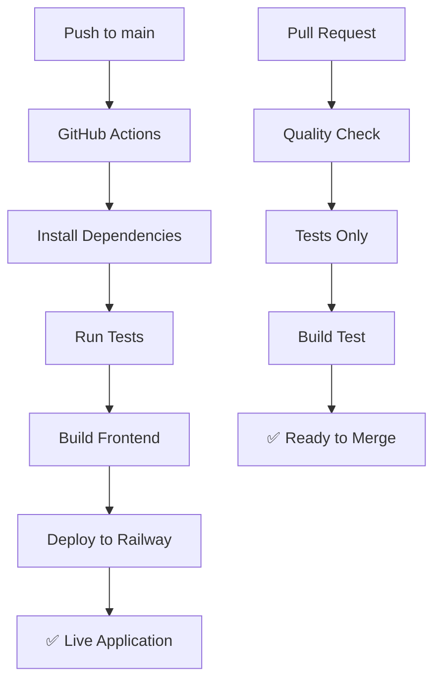

# 🤖 GitHub Actions + Railway - Guia Completo

## 🎯 O que foi configurado

Criei um pipeline completo de CI/CD que automatiza:

- ✅ **Testes automáticos** (backend + frontend)
- ✅ **Build do frontend** para produção
- ✅ **Deploy automático** no Railway
- ✅ **Notificações** de status
- ✅ **Verificação de qualidade** em PRs

## 📁 Arquivos Criados

```
.github/
├── workflows/
│   ├── railway-deploy.yml    # Deploy principal (main branch)
│   ├── deploy.yml           # Deploy avançado (alternativo)
│   └── pr-check.yml         # Verificação de PRs
└── setup-github-secrets.md  # Guia de configuração
```

## 🚀 Configuração Rápida (5 minutos)

### Passo 1: Criar Conta no Railway
1. Acesse https://railway.app
2. Faça login com GitHub
3. Crie um novo projeto (pode ser vazio por enquanto)

### Passo 2: Obter Token do Railway
1. Vá em https://railway.app/account/tokens
2. Clique em "Create New Token"
3. Nome: `github-actions`
4. **Copie o token** (você só verá uma vez!)

### Passo 3: Configurar Secret no GitHub
1. Vá para seu repositório no GitHub
2. **Settings** > **Secrets and variables** > **Actions**
3. Clique em **New repository secret**
4. Nome: `RAILWAY_TOKEN`
5. Value: `[cole o token aqui]`
6. Clique em **Add secret**

### Passo 4: Testar o Pipeline
```bash
# Fazer qualquer mudança e push
git add .
git commit -m "feat: configurar CI/CD"
git push origin main
```

## 🔄 Como Funciona

### Fluxo Automático


### Triggers
- **Push para main/master:** Deploy completo
- **Pull Request:** Apenas testes e verificações
- **Manual:** Pode executar quando quiser

## 📊 Workflows Disponíveis

### 1. `railway-deploy.yml` (Recomendado)
- **Quando:** Push para main
- **O que faz:** Testa + Build + Deploy
- **Simples e robusto**

### 2. `deploy.yml` (Avançado)
- **Quando:** Push para main
- **O que faz:** Pipeline completo com health check
- **Mais recursos, mais complexo**

### 3. `pr-check.yml`
- **Quando:** Pull Request
- **O que faz:** Testes e verificação de qualidade
- **Não faz deploy**

## 🎛️ Configurações Avançadas

### Variáveis de Ambiente no Railway
Após o primeiro deploy, configure no Railway:
```env
JWT_SECRET=sua_chave_super_secreta_aqui
NODE_ENV=production
```

### Customizar o Pipeline
Edite `.github/workflows/railway-deploy.yml`:

```yaml
# Mudar versão do Node
env:
  NODE_VERSION: '20'  # ou '18', '16'

# Adicionar steps customizados
- name: 🔍 Custom Check
  run: |
    echo "Seu comando aqui"
```

## 📱 Monitoramento

### GitHub Actions
- Vá em **Actions** no seu repositório
- Acompanhe execuções em tempo real
- Veja logs detalhados de cada step

### Railway Dashboard
- https://railway.app/dashboard
- Logs da aplicação
- Métricas de uso
- Configurações

## 🚨 Troubleshooting

### ❌ "Railway token not found"
**Solução:**
1. Verificar se o secret `RAILWAY_TOKEN` existe
2. Confirmar se o token não expirou
3. Gerar novo token se necessário

### ❌ "Build failed"
**Solução:**
1. Verificar logs no GitHub Actions
2. Testar build localmente:
   ```bash
   cd frontend && npm run build
   ```
3. Verificar dependências

### ❌ "Tests failed"
**Solução:**
1. Executar testes localmente:
   ```bash
   cd frontend && npm test
   cd backend && npm test
   ```
2. Corrigir testes quebrados
3. Fazer novo commit

### ❌ "Deploy failed"
**Solução:**
1. Verificar se o projeto Railway existe
2. Confirmar permissões do token
3. Verificar logs do Railway

## 🎉 Benefícios do Pipeline

### Para Desenvolvimento
- ✅ **Testes automáticos** - Catch bugs early
- ✅ **Build verificado** - Garante que funciona
- ✅ **Deploy automático** - Zero friction
- ✅ **Feedback rápido** - Sabe imediatamente se algo quebrou

### Para Demonstração
- ✅ **Sempre atualizado** - Última versão sempre online
- ✅ **URL estável** - Pode compartilhar com confiança
- ✅ **Rollback fácil** - Se algo der errado
- ✅ **Histórico completo** - Todas as mudanças rastreadas

## 🔮 Próximas Melhorias

Depois que estiver funcionando, podemos adicionar:

- 🔍 **Análise de código** (ESLint, Prettier)
- 📊 **Métricas de performance**
- 🔒 **Testes de segurança**
- 📧 **Notificações por email/Slack**
- 🌍 **Deploy em múltiplos ambientes**

## 💡 Dicas Importantes

1. **Mantenha o token seguro** - Nunca compartilhe
2. **Teste localmente primeiro** - Evita builds quebrados
3. **Use branches** - Para features grandes
4. **Monitore os custos** - Railway tem limites gratuitos
5. **Documente mudanças** - Commits descritivos

---

## 🚀 Pronto para usar!

Agora você tem um pipeline profissional que:
- Testa automaticamente seu código
- Faz deploy sem intervenção manual
- Mantém sua aplicação sempre atualizada
- Dá feedback imediato sobre problemas

**Basta fazer push e relaxar!** 😎