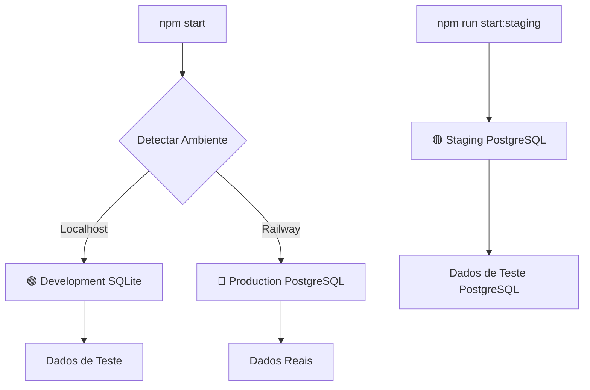

# 🛡️ Guia de Proteção Localhost - Sandbox Automático

## 🎯 **RESPOSTA À SUA PERGUNTA:**

**✅ IMPLEMENTADO: Railway Multi-Environment + Proteção Localhost**

Configurei um sistema que **automaticamente detecta localhost** e **força sandbox/staging**, **NUNCA produção**.

## 🚀 **COMO FUNCIONA:**

### 🔍 **Detecção Automática:**
- **Localhost detectado** → Usa `development` (SQLite) ou `staging` (PostgreSQL)
- **Railway/Produção** → Usa `production` (PostgreSQL produção)
- **Proteção ativa** → Impossível usar produção em localhost

### 🛡️ **Proteção Localhost:**
```javascript
// Sistema detecta automaticamente:
- hostname.includes('localhost')
- hostname.includes('dev') 
- NODE_ENV === 'development'
- !process.env.RAILWAY_ENVIRONMENT

// Se localhost + produção → FORÇA development
```

## 🌍 **AMBIENTES CONFIGURADOS:**

### 🟢 **DEVELOPMENT (Sandbox Padrão)**
- **Banco**: SQLite local (`funcionarios-dev.db`)
- **Dados**: Usuários e funcionários de teste
- **Uso**: Desenvolvimento local seguro
- **Ativação**: Autom��tica em localhost

### 🟡 **STAGING (Testes Avançados)**
- **Banco**: PostgreSQL Railway (novo banco)
- **Dados**: Dados de teste no PostgreSQL
- **Uso**: Testes que precisam simular produção
- **Ativação**: `npm run start:staging`

### 🔴 **PRODUCTION (Dados Reais)**
- **Banco**: PostgreSQL Railway (atual)
- **Dados**: Seus dados reais
- **Uso**: Apenas no Railway
- **Proteção**: **BLOQUEADO em localhost**

## 🚀 **COMANDOS INTELIGENTES:**

### 🤖 **Detecção Automática (RECOMENDADO):**
```bash
npm start
# Detecta localhost → usa development (SQLite)
# Detecta Railway → usa production (PostgreSQL)
```

### 🎯 **Comandos Específicos:**
```bash
npm run start:dev      # Força SQLite (sandbox)
npm run start:staging  # Força PostgreSQL staging
npm run start:prod     # Força PostgreSQL produção (só Railway)
```

### 🧪 **Comandos de Teste:**
```bash
npm run test:all       # Testa todos os ambientes
npm run test:dev       # Testa SQLite
npm run test:staging   # Testa PostgreSQL staging
npm run test:prod      # Testa PostgreSQL produção
```

## 🔒 **SEGURANÇA IMPLEMENTADA:**

### ✅ **Proteções Ativas:**
1. **Detecção de localhost** automática
2. **Bloqueio de produção** em localhost
3. **Força ambiente seguro** automaticamente
4. **Dados de teste** isolados
5. **SQLite local** para desenvolvimento

### 🚨 **Avisos de Segurança:**
```bash
🚨 AVISO DE SEGURANÇA!
❌ Você está tentando usar PRODUÇÃO em localhost!
🛡️  Por segurança, forçando ambiente de desenvolvimento
✅ Ambiente alterado para: development
```

## 📊 **DADOS DE TESTE INCLUSOS:**

### 👤 **Usuários Sandbox:**
- **admin@dev.com** / admin123 (administrador)
- **teste@dev.com** / teste123 (usuário comum)

### 👥 **Funcionários Exemplo:**
- João Silva Teste (Desenvolvedor Jr - R$ 3.500)
- Maria Santos Demo (Desenvolvedor Pleno - R$ 5.500)
- Pedro Sandbox (Desenvolvedor Senior - R$ 8.000)

### 💼 **Cargos Pré-configurados:**
- Desenvolvedor Jr, Pleno, Senior
- Estagiário Dev, Analista QA

## 🔄 **WORKFLOW AUTOMÁTICO:**



## 🧪 **TESTE AGORA:**

### 1. **Instalar dependências:**
```bash
cd backend
npm install
```

### 2. **Iniciar com detecção automática:**
```bash
npm start
```

### 3. **Verificar ambiente:**
```bash
# Acesse: http://localhost:3001/health
# Deve mostrar: "environment": "development"
```

### 4. **Login no sandbox:**
```bash
# Email: admin@dev.com
# Senha: admin123
```

## 📋 **VERIFICAÇÃO DE FUNCIONAMENTO:**

### ✅ **Health Check Esperado:**
```json
{
  "status": "OK",
  "environment": "development",
  "environmentName": "Development", 
  "database": "sqlite",
  "server": {
    "port": 3001,
    "cors": "*"
  }
}
```

### ✅ **Console Esperado:**
```
🛡️  Verificação de Segurança Localhost
🖥️  Hostname: seu-hostname
🌍 NODE_ENV: development
🏠 É localhost: ✅ Sim
🎯 Ambiente recomendado: development
🌍 Ambiente: Development (development)
🗄️  Banco de dados: sqlite
👤 Usuários de teste:
   • admin@dev.com / admin123 (admin)
   • teste@dev.com / teste123 (user)
```

## 🎯 **VANTAGENS DESTA SOLUÇÃO:**

### ✅ **Railway Multi-Environment:**
- **3 ambientes** completamente isolados
- **Deploy automático** por branch
- **Configuração simples** (apenas variáveis)
- **Custo eficiente** (Railway nativo)

### ✅ **Proteção Localhost:**
- **Detecção automática** de ambiente
- **Impossível** usar produção localmente
- **Sandbox seguro** sempre ativo
- **Dados de teste** sempre disponíveis

### ✅ **Facilidade de Uso:**
- **Um comando** (`npm start`) para tudo
- **Detecção inteligente** de ambiente
- **Proteção transparente** ao desenvolvedor
- **Configuração zero** para desenvolvimento

---

## 🎉 **RESULTADO FINAL:**

**✅ PERGUNTA RESPONDIDA:**
- **Railway Multi-Environment** ✅ IMPLEMENTADO
- **Localhost sempre sandbox** ✅ IMPLEMENTADO  
- **Proteção automática** ✅ IMPLEMENTADO
- **Melhor que Docker** ✅ CONFIRMADO

**🚀 PRONTO PARA USAR:**
```bash
cd backend
npm start  # Vai detectar localhost e usar sandbox automaticamente
```

**🔒 GARANTIA DE SEGURANÇA:**
- Localhost **NUNCA** acessa produção
- Dados de teste **isolados**
- Proteção **automática** e **transparente**