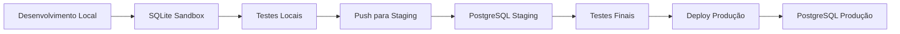

# 🎮 Guia do Ambiente Sandbox

## 🎯 **RESPOSTA À SUA PERGUNTA:**

**✅ RECOMENDAÇÃO: Railway Multi-Environment**

Configurei **3 ambientes** para você:
- 🟢 **Development** (SQLite local) - Sandbox completo
- 🟡 **Staging** (PostgreSQL Railway) - Testes finais  
- 🔴 **Production** (PostgreSQL Railway) - Dados reais

## 🚀 **Como Usar o Sandbox:**

### 1. Ambiente Development (Recomendado para Sandbox)
```bash
cd backend
npm run start:dev
```

**Características:**
- ✅ **SQLite local** (não afeta produção)
- ✅ **Dados de teste** inclusos
- ✅ **Usuários pré-criados**
- ✅ **Funcionários de exemplo**
- ✅ **Isolamento completo**

### 2. Alternar Ambientes
```bash
# Sandbox local (SQLite)
npm run env:dev

# Staging (PostgreSQL Railway)
npm run env:staging  

# Produção (PostgreSQL Railway)
npm run env:prod
```

### 3. Testar Conexões
```bash
# Testar ambiente atual
npm run test:db

# Testar ambiente específico
npm run test:dev      # SQLite
npm run test:staging  # PostgreSQL Staging
npm run test:prod     # PostgreSQL Produção
```

## 🗄️ **Dados do Sandbox (Development):**

### 👤 **Usuários de Teste:**
- **admin@dev.com** / admin123 (administrador)
- **teste@dev.com** / teste123 (usuário comum)

### 👥 **Funcionários de Exemplo:**
- João Silva Teste (Desenvolvedor Jr)
- Maria Santos Demo (Desenvolvedor Pleno)  
- Pedro Sandbox (Desenvolvedor Senior)

### 💼 **Cargos Pré-configurados:**
- Desenvolvedor Jr (R$ 3.500)
- Desenvolvedor Pleno (R$ 5.500)
- Desenvolvedor Senior (R$ 8.000)
- Estagiário Dev (R$ 20/hora)
- Analista QA (R$ 4.500)

## 🔄 **Workflow Recomendado:**



## 📋 **Comandos Úteis:**

### Desenvolvimento (Sandbox)
```bash
npm run start:dev     # Iniciar em modo desenvolvimento
npm run test:dev      # Testar conexão SQLite
```

### Staging (Testes)
```bash
npm run start:staging # Iniciar em modo staging
npm run test:staging  # Testar conexão PostgreSQL staging
```

### Produção
```bash
npm run start:prod    # Iniciar em modo produção
npm run test:prod     # Testar conexão PostgreSQL produção
```

## 🔍 **Verificar Ambiente Atual:**

Acesse: `http://localhost:3001/health`

**Exemplo de resposta (Development):**
```json
{
  "status": "OK",
  "environment": "development",
  "environmentName": "Development",
  "database": "sqlite",
  "server": {
    "port": 3001,
    "cors": "*"
  },
  "timestamp": "2024-01-01T12:00:00.000Z"
}
```

## 🎯 **Vantagens desta Abordagem:**

### ✅ **Railway Multi-Environment:**
- **Isolamento completo** entre ambientes
- **Deploy automático** por branch
- **Configuração simples** (apenas variáveis)
- **Custo eficiente** (Railway oferece múltiplos serviços)
- **Simula produção** real

### ✅ **SQLite Local (Development):**
- **Sandbox perfeito** para desenvolvimento
- **Dados de teste** sempre disponíveis
- **Não afeta produção** nunca
- **Rápido** para testes locais
- **Reset fácil** (só deletar o arquivo .db)

## 🆚 **Por que não Docker?**

**Docker seria mais complexo:**
- ❌ Configuração adicional
- ❌ Recursos locais (CPU/RAM)
- ❌ Não simula ambiente real
- ❌ Mais dependências

**Railway é mais simples:**
- ✅ Configuração nativa
- ✅ Ambiente real de produção
- ✅ Deploy automático
- ✅ Sem dependências locais

## 🚀 **Próximos Passos:**

1. **Testar Sandbox:**
```bash
cd backend
npm run start:dev
```

2. **Acessar Health Check:**
```
http://localhost:3001/health
```

3. **Login no Sandbox:**
- Email: admin@dev.com
- Senha: admin123

4. **Configurar Staging no Railway** (quando necessário)

---

**🎉 Pronto! Você tem um sandbox completo que não afeta a produção!**