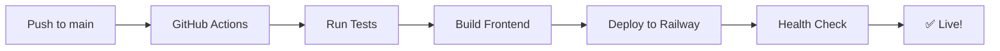

# 🔐 Configuração dos GitHub Secrets

Para o GitHub Actions funcionar com o Railway, você precisa configurar alguns secrets no repositório.

## 🚀 Secrets Necessários

### 1. RAILWAY_TOKEN
**Como obter:**
1. Acesse https://railway.app/account/tokens
2. Clique em "Create New Token"
3. Dê um nome: `github-actions-deploy`
4. Copie o token gerado

### 2. RAILWAY_SERVICE_ID (Opcional, mas recomendado)
**Como obter:**
1. Acesse seu projeto no Railway
2. Vá em Settings > General
3. Copie o "Service ID"

## 🔧 Como Configurar no GitHub

### Passo 1: Acessar Configurações
1. Vá para seu repositório no GitHub
2. Clique em **Settings** (aba superior)
3. No menu lateral, clique em **Secrets and variables** > **Actions**

### Passo 2: Adicionar Secrets
1. Clique em **New repository secret**
2. Adicione cada secret:

**Secret 1:**
- Name: `RAILWAY_TOKEN`
- Secret: `[cole o token do Railway aqui]`

**Secret 2 (opcional):**
- Name: `RAILWAY_SERVICE_ID`
- Secret: `[cole o service ID aqui]`

## 🎯 Configuração Alternativa (Mais Simples)

Se preferir uma configuração mais simples, você pode usar apenas o Railway CLI no GitHub Actions:

### Método Simplificado
1. Apenas configure o `RAILWAY_TOKEN`
2. O workflow detectará automaticamente o serviço
3. Menos configuração, mesmo resultado

## ✅ Verificação

Após configurar os secrets:
1. Faça um commit e push
2. Vá em **Actions** no GitHub
3. Verifique se o workflow está executando
4. Acompanhe os logs em tempo real

## 🔄 Fluxo Completo

## 🚨 Troubleshooting

### Erro: "Railway token not found"
- Verifique se o secret `RAILWAY_TOKEN` está configurado
- Confirme se o token não expirou

### Erro: "Service not found"
- Configure o `RAILWAY_SERVICE_ID`
- Ou remova a linha `service:` do workflow

### Erro: "Build failed"
- Verifique os logs do GitHub Actions
- Teste o build localmente primeiro

## 📱 Notificações

O workflow enviará notificações automáticas:
- ✅ Deploy bem-sucedido
- ❌ Falhas no processo
- 📊 Resumo do deployment

## 🎉 Próximos Passos

1. Configure os secrets
2. Faça um push para testar
3. Acompanhe o primeiro deploy
4. Compartilhe a URL gerada!

---

**💡 Dica:** Mantenha os tokens seguros e nunca os compartilhe publicamente!